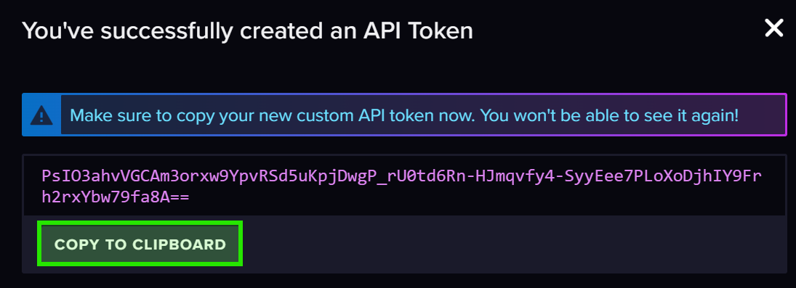

<p align="center">
    
</p> 

#  Tyzen9 - InfluxDB and Grafana in Home Assistant
This compose stack provides InfluxDB and Grafana support, and is specifically targeted for use with Home Assistant.  

## Prerequisites
Install [Docker Engine](https://docs.docker.com/get-docker/) or [Docker Desktop](https://docs.docker.com/desktop/) if you require the Docker user interface.  In production it's generally best to use [Docker Engine](https://docs.docker.com/get-docker/) on a Linux host operating system, and a lightweight service delivery platform designed for managing containerized applications such as [Portainer](https://www.portainer.io/)

This documentation assumes you have a working knowledge of [Docker](https://www.docker.com/), and [Home Assistant](https://www.home-assistant.io/) administration.

## Container Configuration
This `docker-compose` implementation is configured using the `environment` section(s) of the `docker-compose.yaml` file.  The values between the `${}` characters are substituted from the `.env` file.  

### ⚠️ NOTE
1. It is important that you populate the `.env` file values with those appropriate for your environment. 
1. I have experience issues when using special characters in the initial InfluxDB password

## Deployment
### Local deployment

If you are interested in working with this compose stack and making adjustments for your environment, then:

1. Clone this repository: `git clone https://github.com/tyzen9/docker-ha-influxdb-grafana.git`
1. Set the configuration options as desired in the `docker-compose.yaml` and `.env` files.
1. Navigate to the project's root directory and run the following command:

```
docker compose up
```

If everything works as expected, you should be able to access InfluxDB at http://localhost:8086 and Grafana at http://localhost:3000


### Production Deployment using Portainer
I use [Portainer](https://www.portainer.io/) to manage and orchestrate my Docker resources in my Production environments. To deploy this into your Portainer environment:

1. In Portainer, choose the Environment to deploy to
1. In the left menu choose Stacks, then click `+ Add stack`
1. Choose `Repository` and fill in the required fields (don't forget name at the top)
1. At the bottom, there is an option to `Load variables from .env file`. Click this button and provide the prepared `.env` file for this environment.
1. Click `Deploy the stack`

If everything works as expected, you should be able to access InfluxDB at http://portainer_hostname:8086 and Grafana at http://portainer_hostname:3000


 

## InfluxDB Configuration 


### Preparing for HA Connection
1. Log into InfluxDB using the username and password as defined in the `.env` file
1. Click the `Load Data` option on the left, and choose `API Tokens`
1. Click `Generate API Token` 
1. Choose `All Access API Token`


1. Give the token a description, and click `SAVE`


1. Copy the resulting `API token string` someplace safe, as you will not be able to access it again



### Connecting HA to InfluxDB
Connecting InfluxDB to Home Assistant is simple, but does require some [changes to the Home Assistant configuration](https://www.home-assistant.io/docs/configuration/). 

📢 The influxdb database integration runs parallel to the Home Assistant database, it does NOT replace it.

Make the following configuration changes:
1. Open the `configuration.yaml` file in Home Assistant
1. Using the [InfluxDB Integration guide](https://www.home-assistant.io/integrations/influxdb/), enter the following as a starting point for the InfluxDB 2.0 configuration. Make sure to substitute the appropriate values from the `.env` file used in the Docker configuration in for the square brackets.
1. You will need to restart Home Assistant to make these changes effective and start sending data to InfluxDB.


```yaml
influxdb:
  api_version: 2
  ssl: false
  host: [InfluxDB Host Name]
  port: [InfluxDB Port]
  token: [API token string]
  organization: [InfluxDB Org]
  bucket: [InfluxDB Bucket]
  tags:
    source: HA
  tags_attributes:
    - friendly_name
  default_measurement: units
  exclude:
    entities:
      - zone.home
    domains:
      - persistent_notification
      - person
  include:
    domains:
      - sensor
      - binary_sensor
      - sun
    entities:
      - weather.home
```

### Finite control
It is possible to be very specific about individual entities that pushed to InfluxDB.  This may be desirable should you wish to control the size and content of your influxDB.  In the example below, I am only allowing for the dryer's exhaust temperature to be pushed to InfluxDB. Each time you update the configuration, you will need to restart Home Assistant to make themeffective.

📢 The absence of an `exclude` option when using `include`, tells Home Assistant to ONLY send the items listed in the `include` configuration.

```yaml
influxdb:
  api_version: 2
  ssl: false
  host: [InfluxDB Host Name]
  port: [InfluxDB Port]
  token: [API token string]
  organization: [InfluxDB Org]
  bucket: [InfluxDB Bucket]
  tags:
    source: HA
  tags_attributes:
    - friendly_name
  default_measurement: units
  include:
    entities:
      - sensor.sensor_tumbledryer_dryer_exhaust_temperature
```

## Testing InfluxDB with Home Assistant
After you have restarted Home Assistant, return to the InfluxDB application and log in.

1. Click on `Data Explorer` in the menu
1. Select `homeassistant` in the `FROM` dialog
1. Set the Filter to `friendly_name`, and you should see a list of your devices that have recorded data into InfluxDB.


# Connecting Grafana

1. Visit Grafana at http://localhost:3000
1. Login with the username: `admin` and password: `admin`
1. If this is your first login, set the new `admin` password and click `submit`
1. In the left menu select `Connections` and `Add new connection`
1. Choose `InfluxDB` from the extensive list to the right
1. In the upper right choose `Add new data source`
1. At the top, give this connection a name
1. In the `Query language` section: choose `Flux` as the query language
1. In the `HTTP` Section: Populate the URL to InfluxDB (in this example this is http://localhost:8086/)
1. In the `InfluxDB Details` setion, enter the `Organization` the `Token` and the `Default Bucket` name.
1. Click `Save & test` and hopefully all is well


